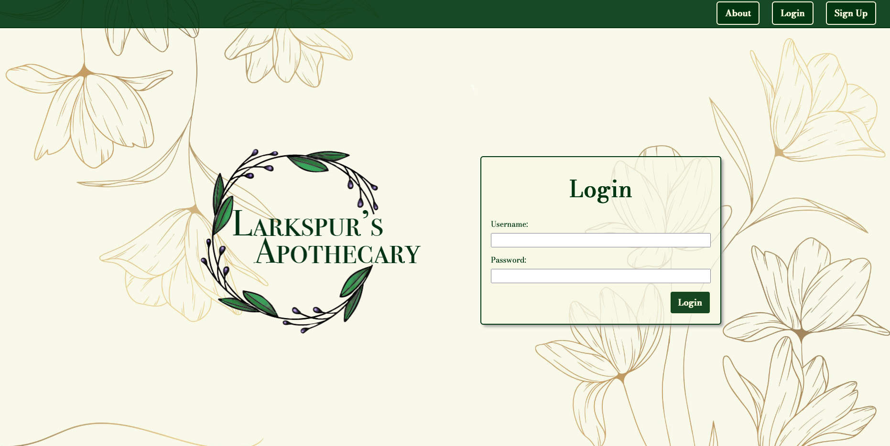
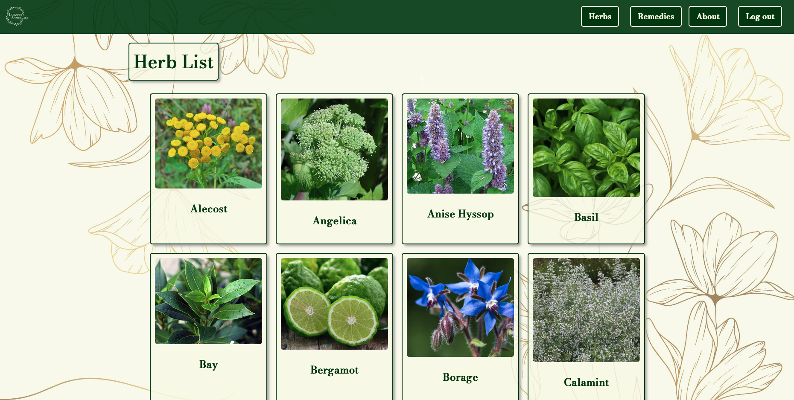
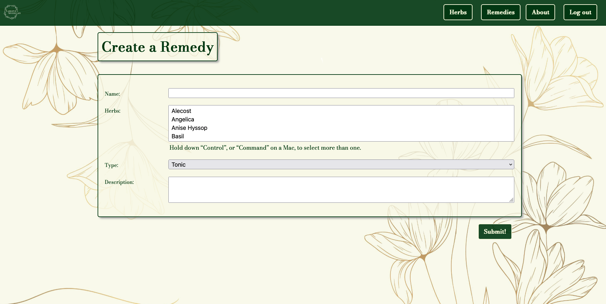
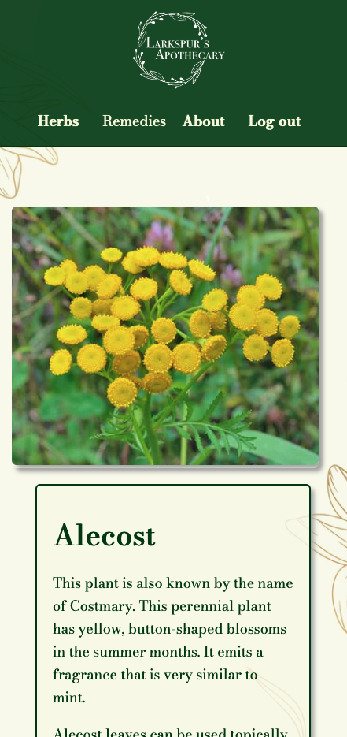

<h1>Larkspur's Apothecary</h1>
I have always been interested in flowers and plants, but I am also a big fan of fantasy novels, potions, and the traditions of cultures using herbs as medicine. So I thought I would combine those interests into one place by creating a fictional apothecary site. 

<h2>To Use</h2>
On Larkspur's Apothecary, you can browse through a list of herbs, click on them to find out more information (including its medicinal properties), and then use those herbs to create your own remedies to share with other users.

The application is deployed <a href="https://larkspurs-apothecary.herokuapp.com/">here</a>.

Click <a href="https://trello.com/b/CsgEzwu4/larkspurs-apothecary">here</a> to view my ERD and wireframe.

<h2>Screenshots</h2>

<h2>Technologies</h2>
<ul>
  <li>Django</li>
  <li>JavaScript</li>
  <li>HTML</li>
  <li>CSS</li>
  <li>AWS</li>
</ul>

<h2>Future Improvements</h2>
<ul>
  <li>Add more herbs, including "rare" ones from different fantasy novels.</li>
  <li>Add a search function for the herbs.</li>
</ul>

<h2>Built With</h2>
<ul>
  <li><b>Font:</b> Google Fonts https://fonts.google.com/</li>  
  <li><b>Icons:</b> 
Icons made by <a href="https://www.flaticon.com/authors/nadiinko" title="Nadiinko">Nadiinko</a> and <a href="https://www.freepik.com" title="Freepik">Freepik</a>from <a href="https://www.flaticon.com/" title="Flaticon">www.flaticon.com</a>
</li>
  <li><b>Wreath Image:</b> <a href="https://www.freepik.com/vectors/wedding">Wedding vector created by pikisuperstar - www.freepik.com</a></li>
  <li><b>Background Image:</b> <a href='https://www.freepik.com/vectors/background'>Background vector created by coolvector - www.freepik.com</a></li>
  <li><b>Favicon:</b> Icon made by <a href="https://www.flaticon.com/authors/icongeek26" title="Icongeek26">Icongeek26</a> from <a href="https://www.flaticon.com/" title="Flaticon">www.flaticon.com</a></li>
</ul>
